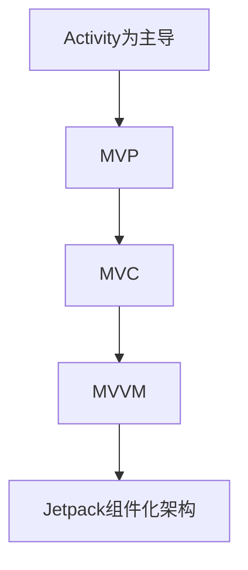

# 第一章：Android架构演进史

## 1.1 演进对比表

| 阶段                  | 代表架构 | 主要特征                    | 主要问题                          |
|---------------------|-------|-------------------------|-------------------------------|
| 早期Activity为主导         | 无      | 逻辑写在Activity/Fragment中       | 代码耦合高，生命周期混乱，难测试             |
| MVP                | MVP   | 业务逻辑与UI解耦              | View引用Presenter易内存泄露             |
| MVC                | MVC   | 控制器分理业务与视图              | Model和View耦合明显                   |
| MVVM               | MVVM  | DataBinding+ViewModel响应式        | 复杂业务DataBinding难维护               |
| Jetpack组件化          | MVVM+  | 以ViewModel、LiveData、Navigation为代表 | 解耦更彻底，生命周期感知，官方推荐            |

## 1.2 各阶段说明与演进流程

### 1. 早期：以 Activity 为主导

- 大量业务代码堆积在 Activity/Fragment 内，生命周期复杂。
- 难以维护及测试。

### 2. MVP 模式

- 将视图(View)、业务逻辑(Presenter)、数据(Model)分离。
- Presenter 持有 View 的引用，易发生内存泄漏。

### 3. MVC 模式

- Controller 处理 Model 与 View 的通信。
- Model 层与 View 层仍有一定耦合。

### 4. MVVM 模式

- 引入 DataBinding 和 ViewModel，实现数据驱动 UI。
- 响应式开发更便捷，但复杂业务下DataBinding会变得臃肿。

### 5. Jetpack组件化架构

- 强调生命周期感知组件 (如ViewModel, LiveData)。
- 提供 Navigation、Room、Paging 等官方库，进一步解耦，提升开发体验。

## 1.3 架构演进图

## 1.4 总结

- Android架构随着业务和团队规模壮大、Google官方支持逐步演进。
- 现代化开发推荐使用Jetpack组件化，充分利用生命周期感知能力解耦UI与业务。

---

# 第二章：

<!-- 第二章原始内容，保留当前 readme 中第二章全部内容，此处为占位符 -->

---

# 附录：官方解读文章链接

- [Google 官方文档 - 架构指南](https://developer.android.com/topic/architecture)
- [Google Android Developers - 架构组件](https://developer.android.com/topic/libraries/architecture)
- [MVVM 官方文档](https://developer.android.com/topic/libraries/architecture/viewmodel)
- [Data Binding 官方文档](https://developer.android.com/topic/libraries/data-binding)
- [Jetpack 主页](https://developer.android.com/jetpack)
